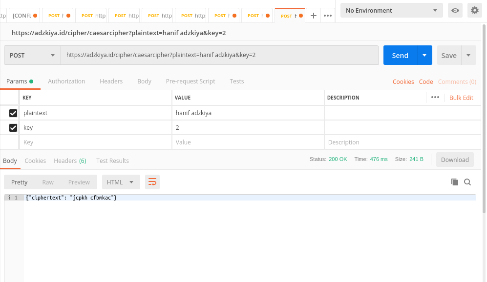
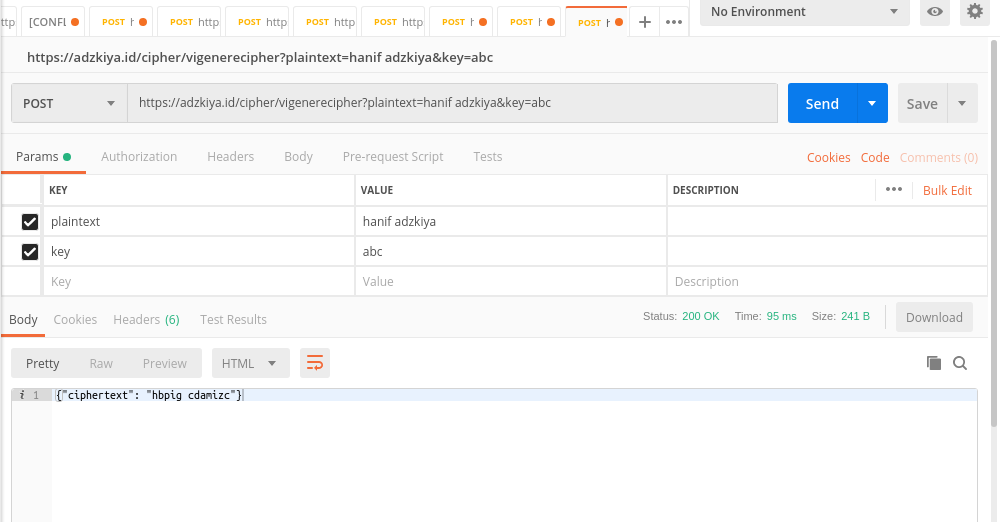

# Kuri
**_(Ubah file README.md ini setelah program diselesaikan)_**

## Deskription

Kuri is master of text encription that delivered specially for you. Now, Kuri can encrypt text with 2 methods, caesar cipher and vigenere cipher. Other methods will come as soon as possible :)

## Spesifikasi API

##1. Caesar Cipher

###LOCAL :

```
	http://127.0.0.1:5000/caesarcipher POST
```

###NETWORK :

```
	https://adzkiya.id/cipher/caesarcipher POST
```

###Either Local or network has params :

```JSON
{
	"plaintext" : "YOUR TEXT",
	"key" : "THE NUMBER OF ALPHABET SHIFT"
}
```
###Output :

```JSON
{
	"ciphertext": "Encrypted Text"
}
```
###Example Request : 

```JSON
{
  "plaintext": "hanif adzkiya",
  "key": "2"
}
```

###Output :

``` JSON
{
	"ciphertext": "jcpkh cfbmkac"
}
```

###Screenshoot :



##2. Vigenere Cipher

###LOCAL :

```
	http://127.0.0.1:5000/vigenerecipher POST
```

###NETWORK :

```
	https://adzkiya.id/cipher/vigenerecipher POST
```

###Either Local or network has params :

```JSON
{
	"plaintext" : "YOUR TEXT",
	"key" : "THE KEYWORD"
}
```
###Output :

```JSON
{
	"ciphertext": "Encrypted Text"
}
```
###Example Request : 

```JSON
{
  "plaintext": "hanif adzkiya",
  "key": "abc"
}
```

###Output :

``` JSON
{
	"ciphertext": "hbpig cdamizc"
}
```

###Screenshoot :

